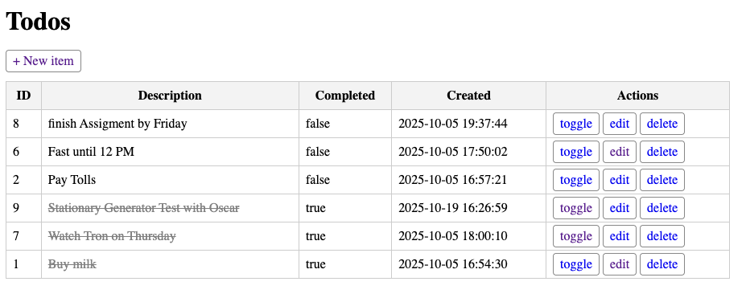

# 📝 TodoApp FullStack — Java Web App

A simple yet complete full-stack Java web application that manages a to-do list using **JSP**, **Servlets**, **Hibernate**, and **MySQL**.  
This project demonstrates how to build, persist, and manage data using a modern Jakarta EE stack, following clean MVC architecture.

---

## 🚀 Features

- Add, edit, delete, and toggle completion of tasks
- Persistent storage using Hibernate ORM + MySQL
- Auto-timestamped task creation (`created_at` field)
- Clean, minimal JSP user interface
- Follows MVC pattern (`Servlet` + `Repository` + `Entity`)
- Works on **Tomcat 10 / 11**

---

## 🛠️ Technologies Used

| Layer | Technology |
|-------|-------------|
| Front-End | JSP, JSTL (`jakarta.tags.core`, `fmt` for date formatting) |
| Back-End | Java Servlets (Jakarta EE), Hibernate ORM |
| Database | MySQL 8 |
| Server | Apache Tomcat 10+ |
| Build Tool | Maven |
| IDE | IntelliJ IDEA |

---

## 📂 Project Structure
````
src/
└── main/
├── java/
│   ├── todo/
│   │   ├── TodoItem.java          # Entity class
│   │   ├── TodoRepository.java    # Data access layer
│   │   └── HibernateUtil.java     # Hibernate factory
│   └── web/
│       └── TodoServlet.java       # Main servlet controller
├── resources/
│   └── hibernate.example.cfg.xml  # Safe example config (no passwords)
└── webapp/
├── list.jsp                   # Displays all tasks
├── form.jsp                   # Add/edit form
└── WEB-INF/web.xml            # Servlet mappings

````
---

## ⚙️ Configuration

Before running, create a **MySQL database** and update your local configuration:

1.  **Create the Database**

    ```sql
    CREATE DATABASE todo_db;
    USE todo_db;
    ```

2.  **Copy the Example Configuration**

    Copy the example Hibernate configuration file and customize it for your local environment:

    ```bash
    cp src/main/resources/hibernate.example.cfg.xml src/main/resources/hibernate.cfg.xml
    ```

3.  **Update Credentials**

    Edit your new `src/main/resources/hibernate.cfg.xml` file with your actual MySQL credentials:

    ```xml
    <property name="hibernate.connection.username">root</property>
    <property name="hibernate.connection.password">your_password_here</property>
    ```

---

## ▶️ Running the App

1.  Open the project in **IntelliJ IDEA** (or any Maven-enabled IDE).
2.  Ensure your **Tomcat 10+ server** is configured in your run configuration.
3.  Run the application — it should deploy automatically to:

    ```arduino
    http://localhost:8080/TodoApp_FullStack/
    ```

4.  Then, navigate to the main list view:

    ```bash
    http://localhost:8080/TodoApp_FullStack/todos/list
    ```

---

## 🖼️ Preview



*(Add your screenshot to `/assets/` and update this path to the correct filename.)*

---

## 🧠 Notes

* `hibernate.cfg.xml` is **excluded from Git** to protect sensitive data.
* Use `hibernate.example.cfg.xml` as your configuration template.
* **Default table:** `todo_items`
* **Columns:** `id`, `description`, `completed`, `created_at`

---

## 👤 Author

* **Julio Lopez**
* 🌐 [lopezbio.com](https://lopezbio.com)
* 💼 [LinkedIn](https://www.linkedin.com/in/julio-lopez-380937282/)
